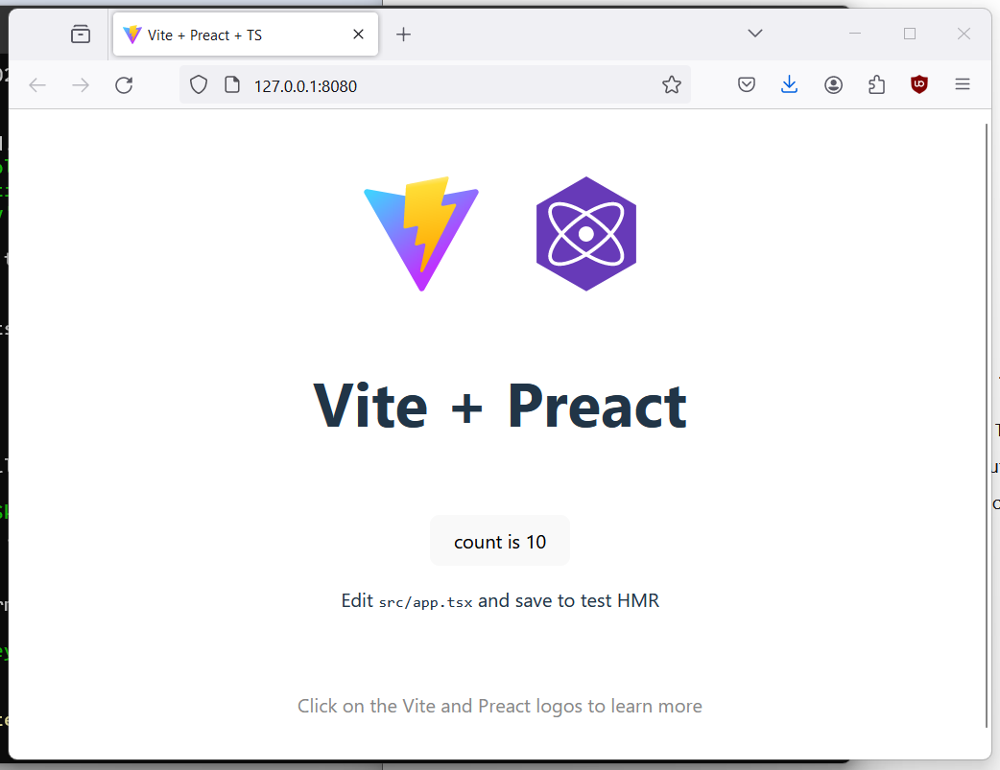

# Vite + Preact Demo

A compact demo of Preact (React but faster) + Vite (a static-site generator) framework.

Vite is hyper focussed at quickly building static sites. It supports a wide range of frameworks incluing React, Svelte, Vue, Preact etc.

Why use vite:

- https://vitejs.dev/guide/why.html

## Localy development

```
npm install
npm run dev
```

## Build

```
npm install
npm run build
```

And if you want to serve it to test it locally:

```
npm install
npm run build
npx http-server ./app/dist
```

Running locally:

